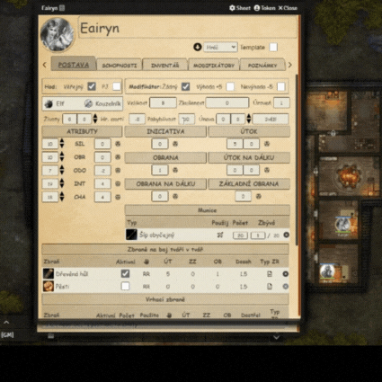
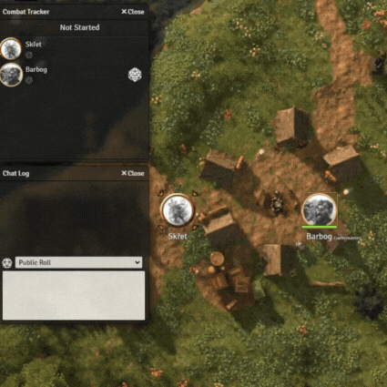
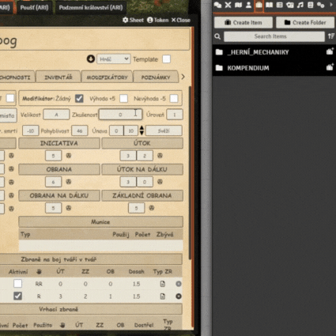

  
# Dračí Hlídka - modul pro VTT Foundry

Instalace
=========

Náš modul obsahuje kompendium pravidel a běží nad herním systémem "Sandbox System Builder". Pro úspěšnou instalaci je třeba splnit následující požadavky.

Požadavky
---------

* VTT Foundry verze 11

* Game system - Sandbox - instalace přes katalog 

* Instalace modulu Dračí Hlídka vložením odkazu přes katalog - <https://raw.githubusercontent.com/DraciHlidka/draci-hlidka-foundryvtt/main/module.json>

* Instalace pomocných modulů z katalogu

    * CodeMirror

První spuštění
--------------

Po instalaci všech komponent můžete vytvořit svůj první svět. Nezapomeňte zvolit systém "Sandbox System Builder". 

Ve světě jako Game Master aktivujeme modul "Dračí Hlídka". Následně na Vás vyskočí dialogové okno pro automatický import. Potvrďte a nechte několik minut běžet. Import skončí znovunačtením okna.

Nyní máte Hlídku k dispozici a můžete začít.

Ovládání modulu
===============

Pro úspěšnou práci s modulem je dobré vědět více o jeho funkcích.

Struktura složek
----------------

Modul rozlišuje dva typy položek. Co je viditelné pro Gamemastera a co pro Hráče. Gamemaster vidí automaticky vše včetně systémových konfigurací. Hráči vidí pouze deníky jim přiřazené a Kompendium.

| Složka | Typ | Viditelnost| Popis |
|--|--|--|--|
| _TEMPLATES | Actor - systémová | GM | Obsahuje šablony pro typy deníku |
| Bestiář PPZ | Actor | GM | Obsahuje PPZ bestiář, doporučujeme položky klonovat pro vlastní použití. |
| _HERNÍ_MECHANIKY | Items - systémová | GM | Obsahuje všechnu mechaniku, kolem deníků. |
| Kompendium PPZ | Items | GM & Hráči | Obsahuje položky PPZ kompendia (předměty, dovednosti, kouzla, atd.) |
| Kompendium PPP | Items | GM & Hráči | Obsahuje položky PPP kompendia (předměty, dovednosti, kouzla, atd.) |

Tvorba postavy / nestvůry / přítele
-----------------------------------

Vytvořte novou položku "Actor"  a zvolte typ vyhovující šablony. U Hráče Vás šablona provede pomocníkem. Další typy šablon jsou více volné.

V případě, že se v deníku nahoře objeví symbol červeného vykřičníku, klikněte na něj a vyberte položky, které chcete postavě přiřadit (například první kouzla u kouzelníka).

Rozdíly v deníku pro GM a Hráče
-------------------------------

Samotné deníky vypadají pro Gamemastera a Hráče trochu jinak. Hráč vidí jen důležité věci a nemůže vše editovat.

Oproti tomu Gamemaster vidí navíc záložky "Skryté" a "cItems".

 "Skryté" - obsahuje hodnoty použité k výpočtům. V naprosté většině případů zde není nutné nijak zasahovat. Vyjímkou snad může být, pokud díky chybě spojení mezi serverem a klientem se zůstane například nějaký bonus aktivní i po jeho deaktivaci. Pak to zde může Gamemaster upravit. V případě dotazů použijte náš Discord.

"cItems" - obsahuje veškeré Itemy v deníku obsažené. Gamemaster je zde může vidět a odstranit. Avšak některé itemy odstranit nelze (jedná se například o zbraň "Pěsti", kterou obdrží každá postava při vzniku a je vázána na jiný cItem). Takovéto cItemy lze odstranit pouze přes nadřazený cItem. V případě dotazů použijte náš Discord.

Hody kostkou
------------

Modul rozlišuje různé typy hodů. Veřejné a pro PJ. Veřejné hody uvidí opravdu všichni a ty pro PJ pouze Gamemaster a hráč, který házel. Navzdory přepínači, existují některé hody/hlášky v chatu, které jsou viditelné pouze pro Gamemastera. Typicky se jedná o spotřebu jídla, vody, munice, atd. Mají význam pro hru, ale není třeba je sdílet všem. Gamemaster může zprávu v chatu vždy ručně zviditelnit, pokud by si to přál.

Použití Bestiáře a vlastních položek kompendia
----------------------------------------------

U Bestiáře doporučujeme danou Nestvůru nejdříve duplikovat a její deník si následně upravit dle představ.

V případě itemů doporučujeme opět naklonovat vhodný předmět/schopnost/kouzlo a upravit dle svých představ. Tak dodržíte mechaniky v něm dané.

U duplikátů ideálně používejte upravená jména.

Pokud budete položky kompendia libovolně upravovat, vystavujete se riziku, že nová verze modulu Vám je přepíše zase zpět dle pravidel.

Iniciativa a boj
----------------

Modul plně podporuje VTT Foundry combat tracker. To znamená, že jakmile označíte tokeny do souboje, můžete házet na iniciativu. Buď z deníku nebo přes Combat tracker.

Životy, mana, suroviny atd.
---------------------------

Všechny tyto položky musí hráč editovat ručně. V chatu se mu ukáže cena seslaného kouzla, ale změnu musí provést sám.

Výjimku tvoří pouze adrenalin, který se sám odečte.

Doplňovací předměty
-------------------

Některé předměty lze po jejich vyčerpání kliknutím na ikonu recyklace zase doplnit. Platí například pro "Měch na vodu".

Naložení, únava, velikost zbroje, požadavky zbraně
--------------------------------------------------

Pokud nechcete hrát na únavu či naložení, jednoduše neditujte políčka únavy a deaktivujte v inventáři sekci naložení.

Velikost zbroje je kontrolována. Postava dostane postih, jakmile si nasadí nesedící zbroj, to samé platí u síly potřebné pro zbraně.

Modifikátory
------------

Pro plošné efekty, efekty lektvarů a kouzel jsou dostupné modifikátory. Stačí je přetáhnout do deníku a v dané sekci aktivovat.

Přestup úrovně
--------------

V případě, že Gamemaster dá postavě dostatek zkušeností, číslo úrovně se samo zvedne. Nic víc se nestane. 

Přestup můžete řešit ručně, přetažením položek a zvednutím životů nebo zvolit automatiku.

Pro automatiku jednoduše na deník postavy přetáhněte položku "Přestup úrovně - XYZ" a řiďte se pokyny. U výběru kouzel/triků/proseb/receptů však modul nehlídá, zda umíte danou školu/obor atd. Mějte to prosím na paměti.

Povolání
========

Zde uvádíme jen speciality pro dané povolání.

PPP - Berserkr, Rytíř a Šermíř
----------

Přiřazení této specializace provedete přetažením daného povolání na deník postavy.

Alchymista
----------

Při výrobě receptů může Alchymista použít "Efektivní a precizní výrobu". Nemusíte se bát, pok je hráč omylem zvolí a danou dovednost nemá. Jednoduše se nepoužije.

Hraničář
--------

Dovednosti jako "Obratné ostří" nebo "Bojová hůl" vždy kontrolují přítomnost dané zbraně.

Dovednost “Zocelení” potřebuje manuálně přidat "Dopočet - Zocelení" pro výpočet pravidla zpětné opravy.

Bonusy za zvířecí přátele je však nutné přidat manuálně k hodu.

Klerik
------

Dovednosti "Křest" a "Pohřební rituál" pracují s hodnotou přízně.

U proseb lze volit mezi světlou a temnou variantou.

Kouzelník
---------

Dovednost "Rituál krve" pracuje s manou i životy.

Dovednost "Paměť na kouzla" potřebuje pustit dopočet pro pravidlo zpětné opravy - vyskočí samo při přestupu úrovně.

Postih za nasazenou zbroj mimo třídu lehká je započítán.

Válečník
--------

Triky odečítají adrenalin a selžou při jeho nedostatku.

Deník sám počítá bonus za jednotlivé školy a hlídá použití jen jedné z nich.

Dovednost "Léčba vlastních zranění" pracuje s adrenalinem i životy.

Pro efekty plošných schopností si ostatní hráči musí v denících přidat a aktivovat správný modifikátor.

Zloděj
------

Dovednosti jako "Vražedné ostří" nebo "Zákeřná kuše" vždy kontrolují přítomnost dané zbraně.
